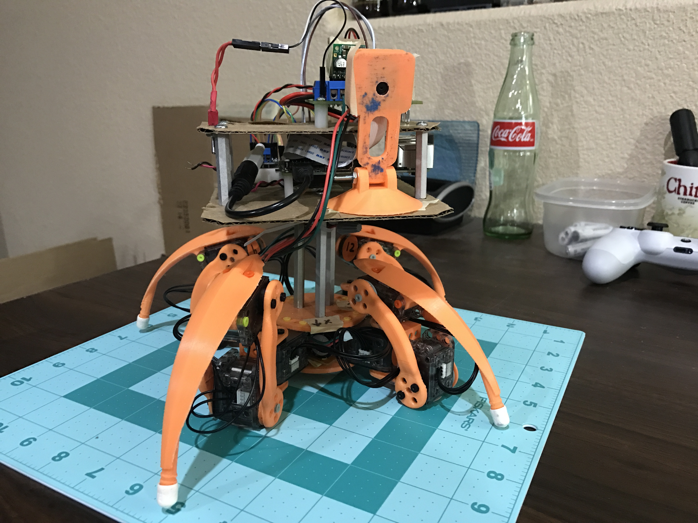
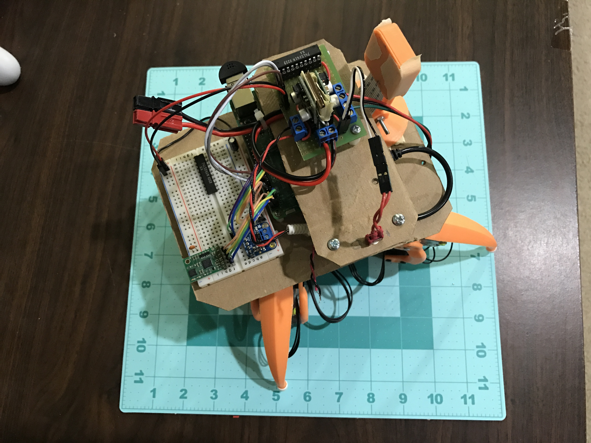
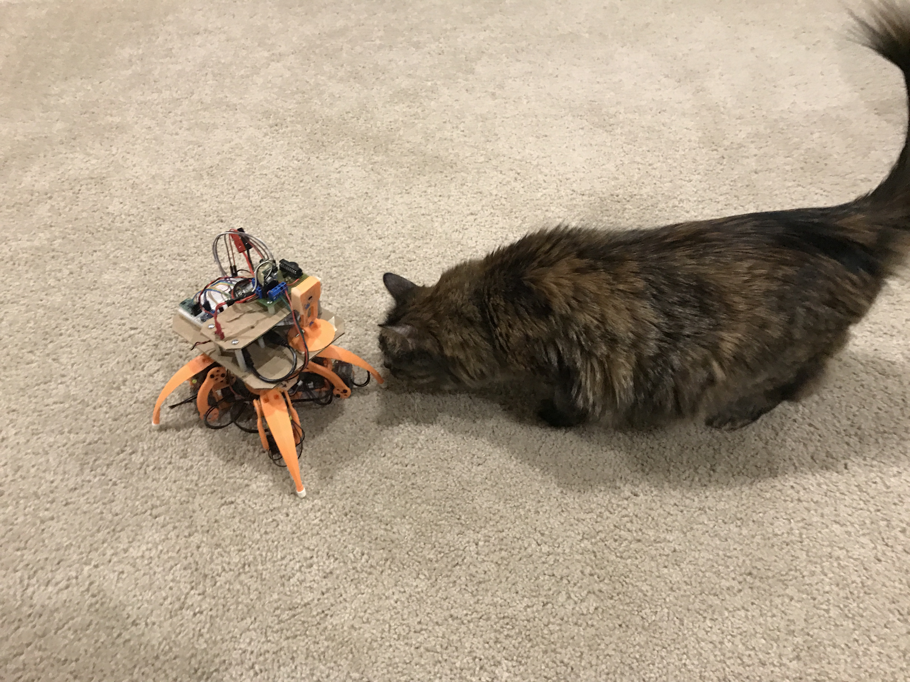
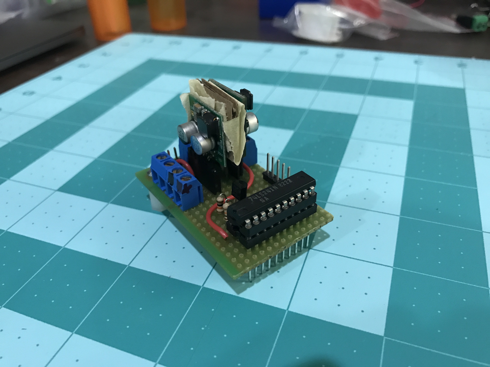
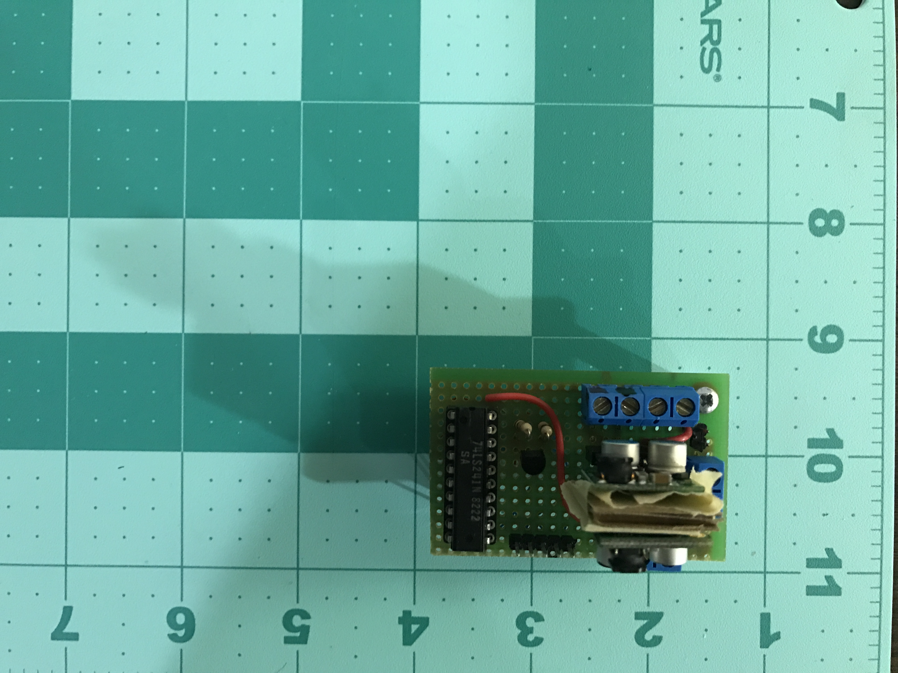
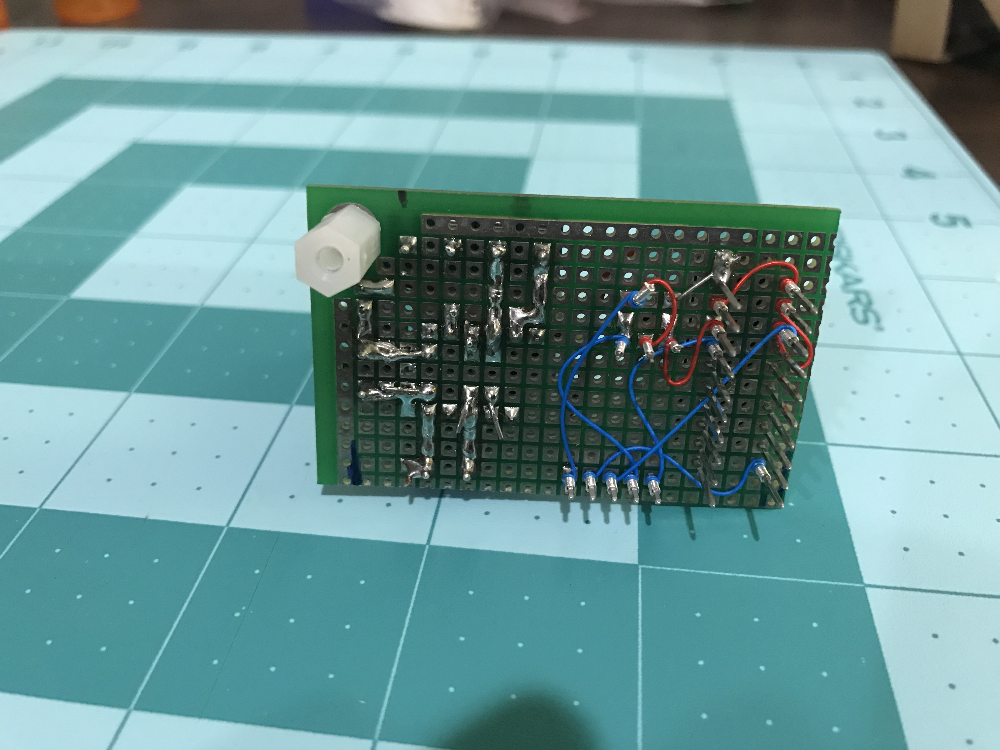
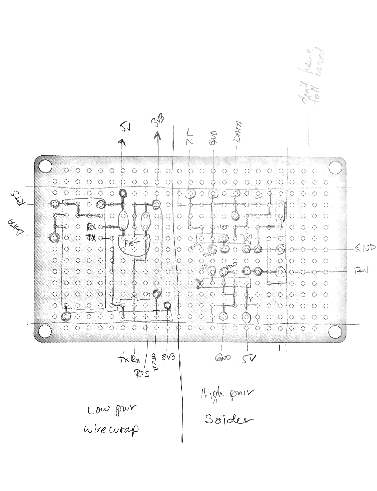
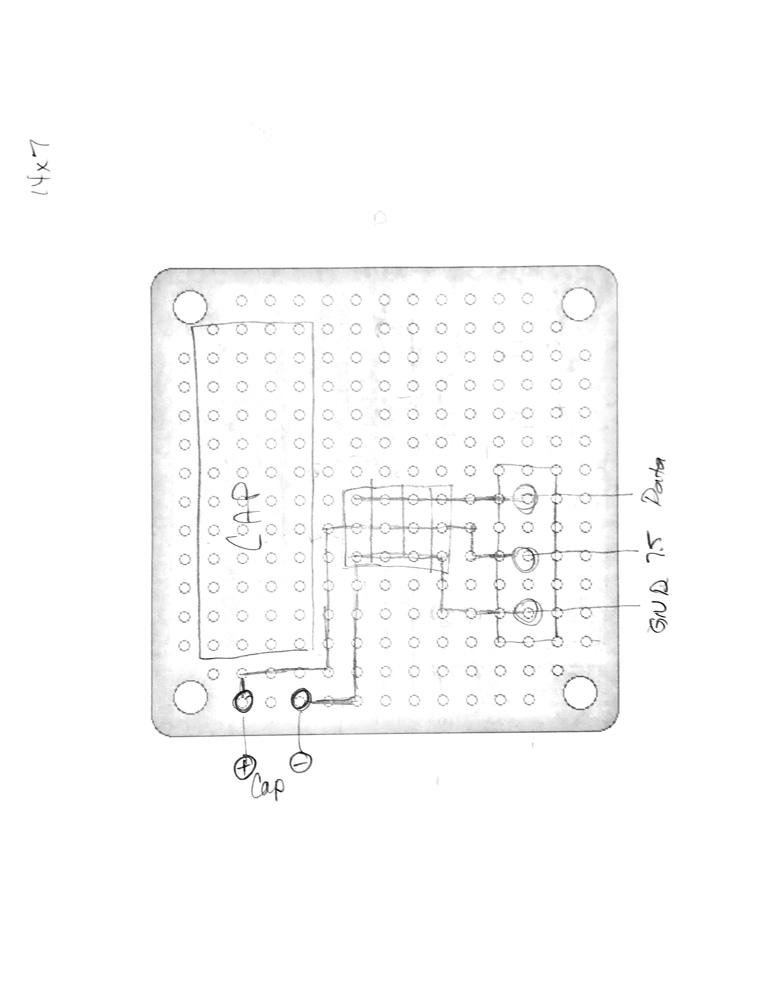

# XL-320 Quadruped

This is my second one after the RC version, which didn't work as nicely as I
wanted it too.

Inspired by the original [Walking Eye](https://www.youtube.com/watch?v=f77gw2Pp3aY)

## Videos

* [YouTube](https://www.youtube.com/watch?v=kH2hlxUfCNg)
* [Vimeo](https://player.vimeo.com/video/194676675)

**Still a work in progress**

## Current Pics

**As of 2017 Feb 26**

Between the mat with a grid in inches and my cat, you can get an idea of the size.

The 2 buck converts (5V and 7.5V) were really close to each other, so I stuck a piece of cardboard between them. To prevent the cardboard from slipping, I also used some tape to hold them in place. I will eventaully turn this into a real PCB once I am fully happy with it and do a better layout.

Decent job of soldering and wire wrapping, however, the scrap of protoboard I was useing only had 1 mounting hole to put a nylon stand off in. So far the single mount point doesn't seem to be an issue.

My hand drawn circuit diagrams using some protoboard pictures I found on the internet. I will eventually turn these into PCB's and post the schematics (probably going to use EagleCAD since it is free).

## Documentation

- [Markdown](./docs/Markdown)
- [Jupyter Notebooks](./docs/ipython)

# Licenses

**Note:** The software, hardware, and documentation are under different licenses.

## Software

**The MIT License (MIT)**

Copyright (c) 2016 Kevin J. Walchko

Permission is hereby granted, free of charge, to any person obtaining a copy of
this software and associated documentation files (the "Software"), to deal in
the Software without restriction, including without limitation the rights to
use, copy, modify, merge, publish, distribute, sublicense, and/or sell copies
of the Software, and to permit persons to whom the Software is furnished to do
so, subject to the following conditions:

The above copyright notice and this permission notice shall be included in all
copies or substantial portions of the Software.

THE SOFTWARE IS PROVIDED "AS IS", WITHOUT WARRANTY OF ANY KIND, EXPRESS OR
IMPLIED, INCLUDING BUT NOT LIMITED TO THE WARRANTIES OF MERCHANTABILITY, FITNESS
FOR A PARTICULAR PURPOSE AND NONINFRINGEMENT. IN NO EVENT SHALL THE AUTHORS OR
COPYRIGHT HOLDERS BE LIABLE FOR ANY CLAIM, DAMAGES OR OTHER LIABILITY, WHETHER
IN AN ACTION OF CONTRACT, TORT OR OTHERWISE, ARISING FROM, OUT OF OR IN
CONNECTION WITH THE SOFTWARE OR THE USE OR OTHER DEALINGS IN THE SOFTWARE.

## Hardware and Documentation

	
	 This work is licensed under a <a rel="license" href="http://creativecommons.org/licenses/by-sa/4.0/">Creative Commons Attribution-ShareAlike 4.0 International License</a>.

