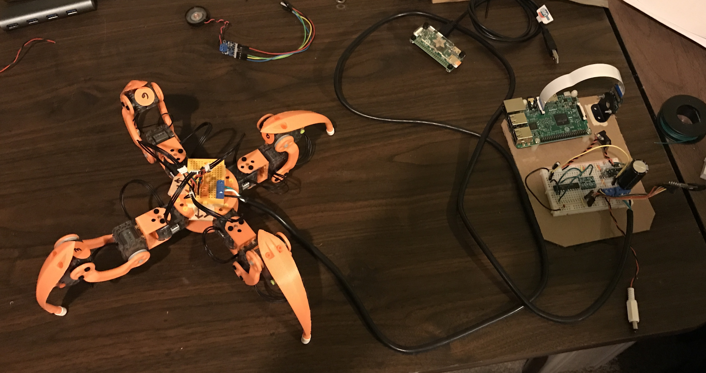
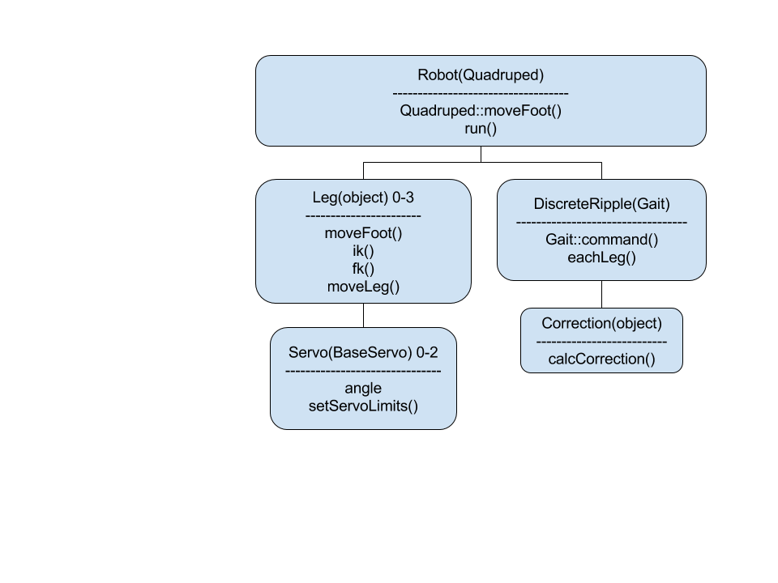
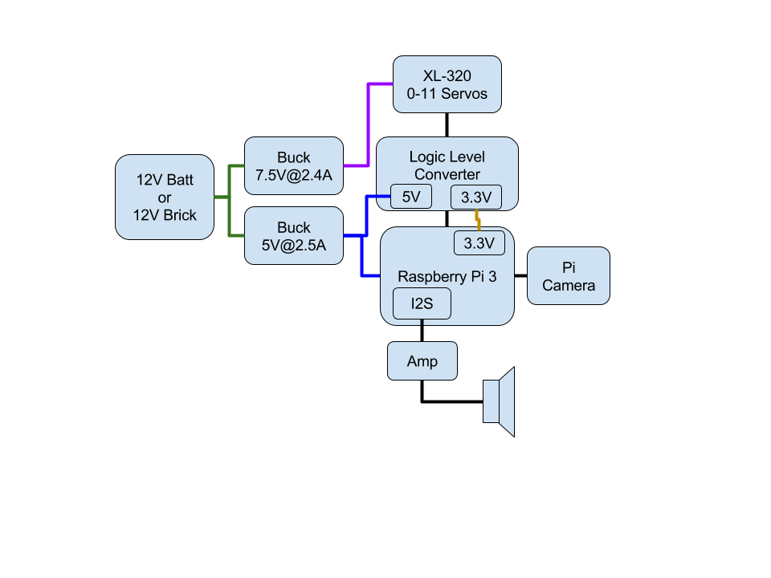

# XL-320 Quadruped

This is my second one after the RC version, which didn't work as nicely as I wanted it too.

Inspired by the original [Walking Eye](https://www.youtube.com/watch?v=f77gw2Pp3aY)

## Videos

* [YouTube](https://www.youtube.com/watch?v=kH2hlxUfCNg)
* [Vimeo](https://player.vimeo.com/video/194676675)

**Still a work in progress**

## Documentation

Since the software is written in python, iPhython (or now [Jupyter](http://jupyter.org/)) is used for interactive
documentation. Take a look at the [docs](https://github.com/walchko/WalkingEye/tree/master/docs/ipython)
folder. The ipython files are where some of the development (e.g., gait, forward/inverse
kinematics, etc) takes place before it is tranferred into the python code.

## Software

The class diagram only shows the main classes and important functions, there is more.

This software requires [pyxl320](https://pypi.python.org/pypi/pyxl320) to work with the
smart servos. You can install it with:

	pip install pyxl320

Since all of the leg servos are on the same RS845 bus, you will need to use `set_id` to
assign an *id* number to each servo **BEFORE** you hook them all together. To see how to
use it, type:

	set_id --help

### This [repository](https://github.com/walchko/pyGeckoRobots/tree/master/quadruped/robotis):

* Robot.py - main code to get things going ... adapt this to your needs.
* Quadruped.py - basic wrapper around leg and gait algorithms
* Leg.py - forward/reverse kinematics
* Gait.py - syncronization of how the 4 legs walk
* Servo.py - talks to the XL-320 smart servos

## Hardware

### Raspberry Pi

I am currently using a 1.2 GHz quad core [RPi 3](https://www.adafruit.com/products/3055)
(ARMv8) as the main board running the lite version of Raspbian. It has on-board:

* 802.11n Wifi
* Bluetooth 4.1 BLE

However, I have done a little testing and it looks like the Pi Zero **might** be powerful
enough to do the job too. When I get more time, I will investigate it more.

### Pi Camera

[PiCamera](https://www.adafruit.com/products/3099) is used to stream images.

### 3D Models

The 3d printer models (stl format) come from the following sources:

* [Legs](https://github.com/mogillc/nico) which are the coxa, femur, and tibia
* Misc brackets I made using [OpenScad](http://www.openscad.org/)

### Cost

Here is a parts list of **key components** that I am using. I am not listing wires, bread boards, cables, etc. Also note,
I have rounded up the costs (i.e., $4.95 => $5). Also, lot of the body is 3d printed, the costs for that are not shown here.

| Part | Source | Number | Item Cost | Sum | Notes |
| ---  | ---    | ---    | ---       | --- | ---   |
| RPi v3                              | [Adafruit](https://www.adafruit.com) | 1 | $40 | $40 | Main board, has wifi and bluetooth already |
| Pi Camera                           | [Adafruit](https://www.adafruit.com) | 1 | $30 | $30 | 8 Mpixel |
| 5V, 2.5A Buck Converter (D24V22F5)  | [Pololu](https://www.pololu.com) | 1 | $10 | $10 | For powering the RPi |
| 5V, 2.4A Buck Converter (D24V22F7)  | [Pololu](https://www.pololu.com) | 1 | $10 | $10 | For powering the xl-320 |
| Dynamixel xl-320 smart servo        | [RobotShop](https://www.robotshop.com) | 12 | $22 | $264 |  |
| PS4 Controller                      | [Walmart](http://www.walmart.com) | 1 | $54 | $54 | |
| Micro SD (32 GB)                    | [Walmart](http://www.walmart.com) | 1 | $12 | $12 | Raspbian |
| 74LS241                             |                                   | 1 | $1 | $1 | Used to convert the RPi's RS232 into a RS485 port |
| 12V, 5A Wall Power Adaptor          | [Pololu](https://www.pololu.com) | 1 | $15 | $15 | So I don't have to always run off batteries |

# PyGecko or ROS [Optional]

You can also use this driver with [PyGecko](https://github.com/walchko/pygecko) (or [ROS](http://www.ros.org)
if you write the interface), see the `pygecko` folder for an example. PyGecko is a simple
ROS like system written in python.

	pip install pygecko

Follow the other installation instructions for pygecko, will requires [ZeroMQ](http://zeromq.org/)
and some other libraries to be installed to work.

# Licenses

**Note:** The software, hardware, and documentation are under different licenses.

## Software

**The MIT License (MIT)**

Copyright (c) 2016 Kevin J. Walchko

Permission is hereby granted, free of charge, to any person obtaining a copy of
this software and associated documentation files (the "Software"), to deal in
the Software without restriction, including without limitation the rights to
use, copy, modify, merge, publish, distribute, sublicense, and/or sell copies
of the Software, and to permit persons to whom the Software is furnished to do
so, subject to the following conditions:

The above copyright notice and this permission notice shall be included in all
copies or substantial portions of the Software.

THE SOFTWARE IS PROVIDED "AS IS", WITHOUT WARRANTY OF ANY KIND, EXPRESS OR
IMPLIED, INCLUDING BUT NOT LIMITED TO THE WARRANTIES OF MERCHANTABILITY, FITNESS
FOR A PARTICULAR PURPOSE AND NONINFRINGEMENT. IN NO EVENT SHALL THE AUTHORS OR
COPYRIGHT HOLDERS BE LIABLE FOR ANY CLAIM, DAMAGES OR OTHER LIABILITY, WHETHER
IN AN ACTION OF CONTRACT, TORT OR OTHERWISE, ARISING FROM, OUT OF OR IN
CONNECTION WITH THE SOFTWARE OR THE USE OR OTHER DEALINGS IN THE SOFTWARE.

## Hardware and Documentation

 This work is licensed under a <a rel="license" href="http://creativecommons.org/licenses/by-sa/4.0/">Creative Commons Attribution-ShareAlike 4.0 International License</a>.
