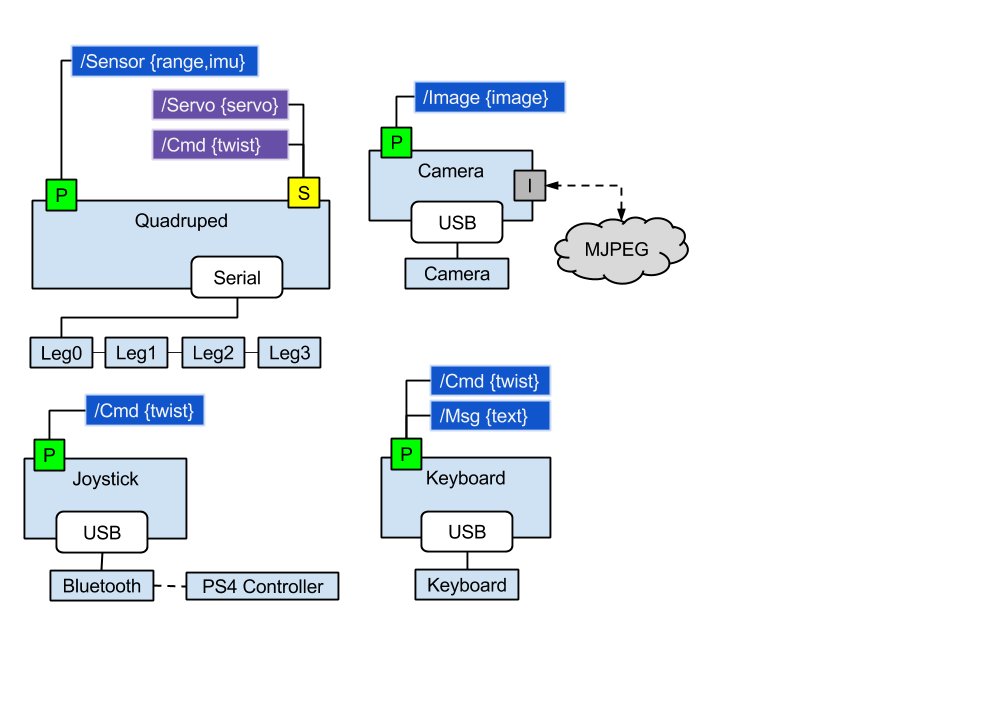

## Software

The class diagram only shows the main classes and important functions, there is more.

This software requires [pyxl320](https://pypi.python.org/pypi/pyxl320) to work
with the smart servos. You can install it with:

	pip install pyxl320

Since all of the leg servos are on the same RS845 bus, you will need to use
`set_id` to assign an *id* number to each servo **BEFORE** you hook them all
together. To see how to use it, type:

	set_id --help

### This [repository](https://github.com/walchko/pyGeckoRobots/tree/master/quadruped/robotis):

* Robot.py - main code to get things going ... adapt this to your needs.
* Quadruped.py - basic wrapper around leg and gait algorithms
* Leg.py - forward/reverse kinematics
* Gait.py - syncronization of how the 4 legs walk
* Servo.py - talks to the XL-320 smart servos
* ahrs - tilt compensated compass which gives roll, pitch, heading

### docs

Documentation and [ipython](http://jupyter.org/) notebooks that show how the
code works. There is also other information on hardware.

### tests

`nose` unit tests ... just run `nosetests -vs *.py`.

### pygecko

Software using [pygecko](https://github.com/walchko/pygecko) to run the robot. It uses the basic driver files in the
main directory.

# PyGecko [Optional]

You can also use this driver with [PyGecko](https://github.com/walchko/pygecko)
(or [ROS](http://www.ros.org) if you write the interface), see the `pygecko`
folder for an example. PyGecko is a simple ROS like system written in python.

	pip install pygecko
	pip install adafruit-lsm303

Follow the other installation instructions for pygecko, will requires
[ZeroMQ](http://zeromq.org/) and some other libraries to be installed to work.

---

	
	 This work is licensed under a <a rel="license" href="http://creativecommons.org/licenses/by-sa/4.0/">Creative Commons Attribution-ShareAlike 4.0 International License</a>.

